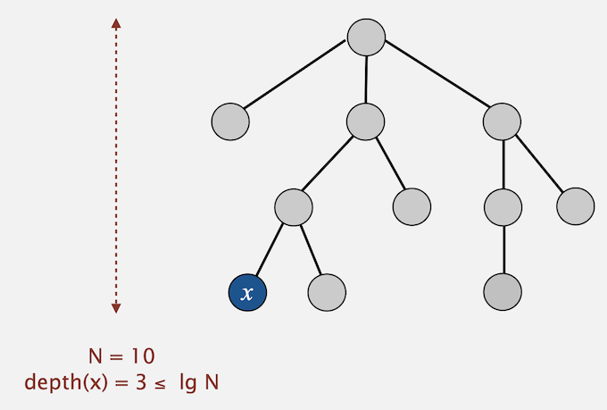

# Coursera - Computer Science from Princeton. 
## Algorithms, Part I, Week 1


[](https://travis-ci.com/dominicfarr/UnionFindAlgorithm) [](https://sonarcloud.io/dashboard?id=domfarr%3AUnionFindAlgorithm) [](https://sonarcloud.io/dashboard?id=domfarr%3AUnionFindAlgorithm) [](https://sonarcloud.io/dashboard?id=domfarr%3AUnionFindAlgorithm) [](https://sonarcloud.io/dashboard?id=domfarr%3AUnionFindAlgorithm)


## Quick Find

Cost model for [Quick Find](src/main/java/domfarr/coursera/computerscience/princeton/algorithms/part1/week1/QuickFind.java) is too expensive.

| Algorithm     | Initialise    | Union | Find |
| ------------- |:-------------:| ------:| ---- |
| Quick Find    | N             | N      | 1    |

It takes N<sup>2</sup> array accesses to process a sequence of N union commands on N objects. That is, **Quadratic** time, which does not scale.


## Quick Union

Cost model for [Quick Union](src/main/java/domfarr/coursera/computerscience/princeton/algorithms/part1/week1/QuickUnion.java) is too expensive.

| Algorithm     | Initialise    | Union | Find |
| ------------- |:-------------:| ------:| ---- |
| Quick Find    | N             | N      | N    |

If Trees get tall, find is too expensive (could be N array accesses).


## Weighted Quick Union

Avoid large trees determine. Balance trees by linking root of smaller tree to root of larger tree. 

A new data structure is required to hold the size of each tree. Initial size is 1, as each tree is the root of itself and of size 1

#### Running time for the following operations:

**Find**: Takes time proportional to depth of p and q. 

**Union**: takes constant time, given roots.

#### Proposition for Find complexity

Time to find is proportional to the depth of any node x, and is at most log<sub>2</sub> N.


<font size="xx-small">source: Algorithms, Part I by Princeton University</font>

#### Question 1: When does depth increase? 

Depth of node X increases by 1 when tree T<sub>1</sub> containing x is merged into another tree T<sub>2</sub>.

```text
   1      4       union(5,3)      1
  / \     |            =>        /|\
 2   3    5(x,D = 1)            2 3 4 // merge roots 4 and 1
                                     \
                                      5(X, D=2)
```

Before union 1 hop to find 5, from the root of 4. After union, 2 hops to find 5 from root of 1

The proposition states: The size of the tree containing x at least doubles since | T<sub>2</sub> | ≥ | T<sub>1</sub> |

#### Question 2: Why can trees double in size. 

Because the maximum tree size being merged is equal to the size of the tree receiving...which means at it can double.

#### Question 3: Why can it only double log<sub>2</sub> times

Total size is N. What is Log<sub>2</sub> N? That is, how many times can we double to reach N

Example N = 16 We can only double 4 times before we get to 16. That is. Log<sub>2</sub>16 = 4
```text
1 + 1 = 2  
2 + 2 = 4
4 + 4 = 8
8 + 8 = 16
```
Therefore the complexity for find operation is proportional to depth, which is Log<sub>2</sub> N